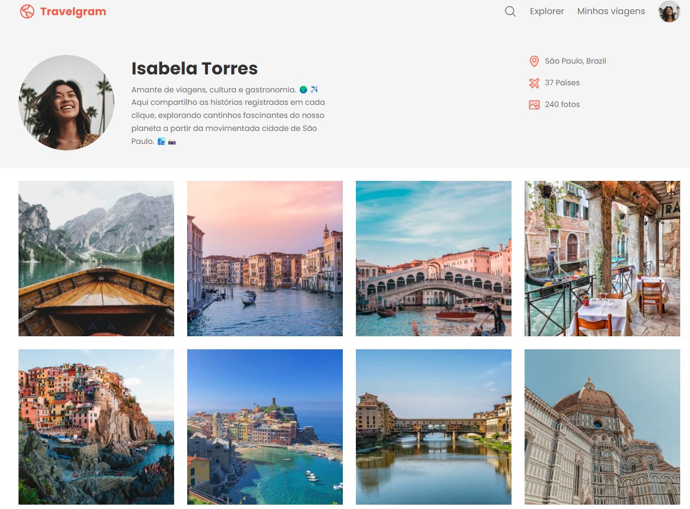

 

    

## 💻 Projeto
Esse é um projeto Web responsivo feito com objetivo de aprofundar conhecimentos sobre HTML e CSS, com uso de variáveis, e flexbox para estilização.

## 👩‍💻 Tecnologias
Esse projeto foi desenvolvido usando as seguintes tecnologias:

- HTML
- CSS
- GIT E Github

## 🏷️ Layout
Você pode visualizar o layout do projeto através [desse link](https://www.figma.com/community/file/1360315496868719817).
É necessário ter uma conta no [Figma](https://www.figma.com).
