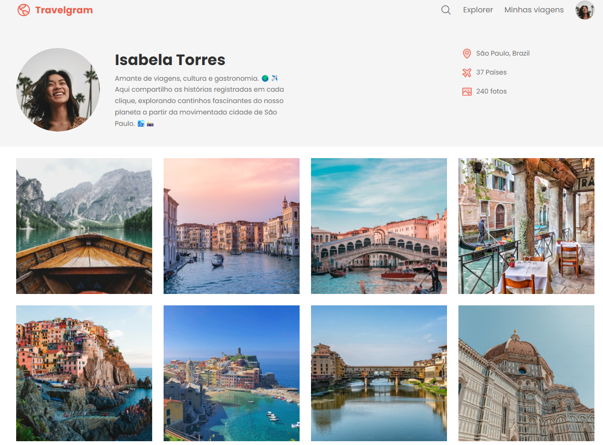

 

    

## 🗺️ Travelgram
This is a responsive web project developed to deepen my knowledge of HTML and CSS, utilizing CSS variables and Flexbox for styling.

## ⚙️ Technologies Used
This project was developed using the following technologies:

- HTML
- CSS
- GIT E Github

## 🏷️ Layout
You can view the project layout through [this link](https://www.figma.com/community/file/1360315496868719817). Note: A Figma account is required [Figma](https://www.figma.com).
